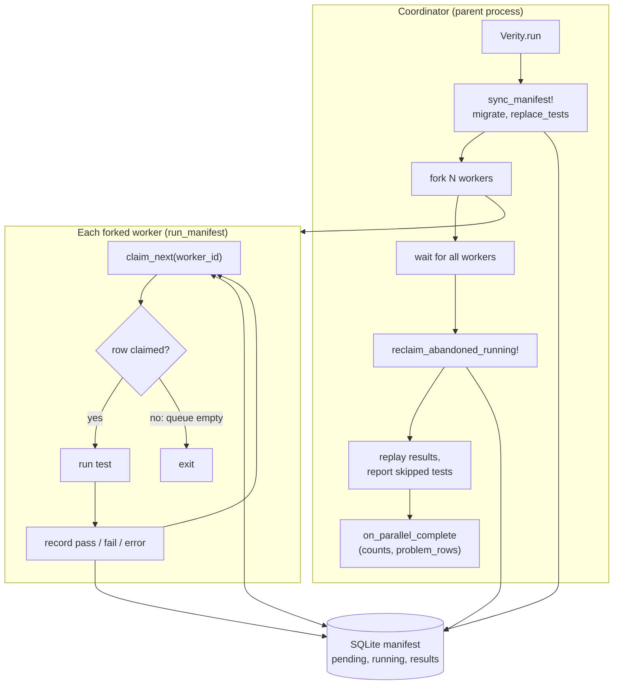
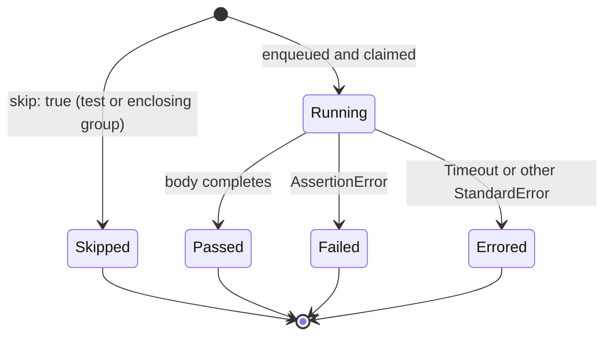

# Verity

Metadata-first Ruby tests: each case is a structured record (tags, timeouts, resource hints) backed by a SQLite manifest queue. The CLI loads discovery files, syncs them into the manifest, and runs tests — either on a single worker or across parallel forked processes that claim tests atomically from the queue.

## Requirements

- Ruby **≥ 3.3**

## Installation

Add to your Gemfile:

```ruby
gem "verity"
```

Or install from the repository root:

```bash
gem build verity.gemspec && gem install verity-*.gem
```

## Running

From a checkout, after dependencies are available:

```bash
./bin/verity
# or
bundle exec verity
```

Positional arguments are treated as file paths or globs — only those files are loaded instead of the configured `test_globs`:

```bash
verity verity/models/user_test.rb
verity verity/models/*_test.rb verity/lib/auth_test.rb
```

Each argument is resolved with `File.expand_path`, so relative paths work from any directory.

Use `--workers` / `-w` to run tests in parallel across forked processes:

```bash
verity -w 4                 # exactly 4 workers
verity -w cpus              # one worker per CPU (Etc.nprocessors)
verity --workers 2 verity/  # combine with positional args
```

Filter descriptive tags (`tags:` / group tags) — flags can be repeated; names are Symbols (`slow` ↔ `:slow`):

```bash
verity -t slow                    # shorthand for --tag; run only matching tests (OR across tags)
verity --tag integration --tag slow
verity --exclude-tag wip          # skip tests that carry this tag (overlapping exclude wins over include)
```

Exit status is **0** if every claimed test passes, **1** otherwise (`exit` in `bin/verity` mirrors that). **2** is used for invalid CLI options — an unknown flag, a bad `--order` value, or a `path:LINE` filter pointing at a missing file — and for an `ArgumentError` raised during the run (e.g. a `:memory:` manifest combined with `--workers > 1`).

```bash
verity --reporter dots
verity -r null
verity -r ./reporters/mine.rb:MyReporter
```

There is no `--version` flag. The current version is available programmatically as `Verity::VERSION`.

Built-in names are the same as for `Verity.build_reporter` (case-insensitive): `colored`, `colored_dots`, `documentation`, `doc`, `dots`, `null`, `none`, `silent`. Custom reporters: `path/to/file.rb:ClassName` (class must `include Verity::Reporter`); the file is `load`ed, then `ClassName.new` is called with no arguments.

`ColoredDotsReporter` (the default) prints green **.** / red **F** / yellow **E** / cyan **S** (skip) when stdout is a TTY. Set `NO_COLOR` in the environment to disable; set `FORCE_COLOR` or `VERITY_FORCE_COLOR` to `"1"`, `"true"`, or `"yes"` (case-insensitive) to force color when not a TTY.

## Execution model

### Parallel runs: the manifest as a work queue

With `worker_count > 1`, the coordinator process syncs all runnable tests into the SQLite manifest, forks the workers, and each worker pulls one test at a time by atomically claiming a `pending` row (marking it `running`). When the queue is drained the worker exits; the coordinator then reclaims any rows left `running` (a crashed worker), replays every recorded result through the reporter, and emits the parallel summary.



When resource resolvers are registered, a worker that finds only tests conflicting with currently-running resources gets `:blocked` from the claim and retries after a short sleep instead of exiting.

### A test's outcome

Every executed test resolves to exactly one status. A clean run is `:pass`; a failed assertion (`AssertionError`) is `:fail`; a timeout or any other raised exception is `:error`. Tests with `skip: true` are never enqueued — they are reported as `:skip` without running.



## Configuration

Use `Verity.configure` before `Verity.run` (or ensure defaults match your layout):

```ruby
Verity.configure do |c|
  c.manifest_path = "verity/manifest.db"   # default; path relative to cwd (ignored by git); or ":memory:" for single-process only
  c.test_globs = ["verity/**/*_test.rb"]   # default; set to your Verity discovery globs
  # c.worker_count = :cpus                 # default; or a positive Integer, or "cpus" / :cpu / "cpu"
  # c.reporter = Verity::Reporters::ColoredDotsReporter.new($stdout)  # default
  # c.included_tags = [:integration]  # optional: only examples whose effective tags match (OR)
  # c.excluded_tags = [:wip]          # optional: drop matching examples after inclusion
end
```

- **`test_globs`** — array of patterns passed to `Dir.glob`; merged and de-duplicated for **`test_files`**.
- **`manifest_path`** — SQLite database path (default **`verity/manifest.db`**), or `":memory:"` for an in-memory DB (only with **`worker_count` 1**).
- **`worker_count`** — number of parallel worker processes (`Integer` or decimal string), or **`:cpus`** / **`:cpu`** / **`"cpus"`** / **`"cpu"`** to use `Etc.nprocessors` (minimum **1**). Resolved at run time via **`Configuration#resolved_worker_count`**. Parallel runs need a **file** manifest (not `":memory:"`) and **`Kernel#fork`**.
- **`reporter`** — object that includes `Verity::Reporter` (default: `Verity::Reporters::ColoredDotsReporter` on `$stdout`). See **Custom reporters** below.
- **`included_tags`** — optional `Array` of `Symbol`; when non-empty, only examples whose **`Verity.effective_tags`** intersect this list run (**OR**: any listed tag matches). Default `[]`.
- **`excluded_tags`** — optional `Array` of `Symbol`; examples with any matching effective tag are removed after inclusion narrowing. Default `[]`.

`Verity.run(worker_id: 0)` loads all `test_files`, migrates the manifest, replaces the `tests` table from the registry, then runs the manifest-driven runner for that worker.

`Verity.load_discovery!` only clears the registry and loads `test_files` (useful if you build your own harness). For each file it precomputes **fingerprints** with **Prism**: the hash covers the **block body** only (description and metadata changes do not change identity). **`Test#file`** and **`Test#line`** remain the **`test` call** location. If you `load` a file outside that path (no plan installed), fingerprints fall back to a line-based slug.

### Custom reporters

Implement {Verity::Reporter} and assign it on configuration. `Verity.run` and `Runner.new` (no `reporter:` keyword) use `Verity.configuration.reporter`. Built-ins live under `Verity::Reporters`:

| Class | Purpose |
|-------|---------|
| `ColoredDotsReporter` | Default — green/red/yellow/cyan dots with ANSI color (TTY-aware) |
| `DotsReporter` | Plain `.` / `F` / `E` dots, no color |
| `DocumentationReporter` | Prints group titles and test descriptions (outline style) |
| `NullReporter` | Discards all output (used internally for parallel child workers) |
| `TestReporter` | In-memory recorder for testing integrations (see below) |
| `CompositeReporter` | Delegates to multiple reporters |
| `ParallelSummaryReporter` | Emits the multi-worker summary block after parallel runs |

```ruby
class MyReporter
  include Verity::Reporter

  def on_run_start(total:, worker_id:)
    # total: expected number of examples for this worker (nil if unknown)
  end

  def on_test_complete(result:, worker_id:)
    # See Verity::Runner::Result: :test, :status (:pass | :fail | :error | :skip), :error
  end

  def on_run_finish(summary:, worker_id:)
    # summary: :total, :passed, :failed, :errored, :skipped, :focus, :tag_filter
  end

  # Optional: after Verity.run with worker_count > 1 (parent process only)
  def on_parallel_complete(counts:, problem_rows:)
  end
end

Verity.configure do |c|
  c.reporter = MyReporter.new
end
```

For a one-off run without changing global config, pass `Verity::Runner.new(reporter: MyReporter.new)`.

### TestReporter

`Verity::Reporters::TestReporter` records every callback in memory (no I/O), useful for testing integrations against the reporter protocol. It exposes four readers:

| Reader | Stores |
|--------|--------|
| `run_starts` | `[{ total:, worker_id: }, ...]` |
| `test_completes` | `[{ status:, error:, worker_id: }, ...]` |
| `run_finishes` | `[{ summary:, worker_id: }, ...]` |
| `parallel_finishes` | `[{ counts:, problem_rows: }, ...]` |

```ruby
reporter = Verity::Reporters::TestReporter.new
Verity.configure { |c| c.reporter = reporter }
Verity.run
reporter.test_completes.count { _1[:status] == :pass }
```

## Grouping

Nest tests under titled sections with **`group`**. Each `test` registers with a **`group_path`** (array of titles) used for output and tooling; fingerprints and execution order are unchanged.

```ruby
group "Authentication", tags: [:integration] do
  group "sessions", focus: true do
    test "creates a session" do
      # ...
    end
  end
end

group "WIP", skip: true do
  test "not scheduled yet" do
  end
end
```

Descriptive **`tags:`** on a **`group`** cascade to every nested test via **`inherited_group_tags`** (outer groups first), and are combined with the test’s own **`tags:`** by **`Verity.effective_tags`** for filtering and CI labelling. **`skip:`** or **`focus:`** on a **`group`** cascade to the effective `skip`/`focus` of every nested test — a test’s effective value is its own keyword OR any enclosing group’s keyword. **`:skip`** and **`:focus`** are no longer tags; placing them in **`tags:`** has no behavioral effect.

**`Verity::Reporters::DocumentationReporter`** prints new group titles when the path changes (indented like an outline). Dot reporters do not show groups. Custom reporters can read **`result.test.group_path`** and **`result.test.inherited_group_tags`**.

The group stack is cleared before each discovery file is loaded so a stray unclosed `group` in one file does not affect the next.

## Tags

- **`skip: true`** — The example is **not** enqueued in the manifest and does **not** run. It still appears in **`Verity::Registry.all`**. The summary line includes **`N skipped`** when `N > 0`. A **`group`** with **`skip: true`** applies to all nested tests (see **Grouping**).
- **`focus: true`** — If **any** non-skipped test is focused (directly or via an enclosing **`group`**), only focused tests run. If every non-skipped test is focused, the filter is inert. **Skip wins:** a test with both `skip: true` and `focus: true` is skipped. When focus narrows the suite, the summary ends with **`(focus)`**.
- **Descriptive tag filters** — `Verity.effective_tags(test)` merges `group tags:` outer-first with the example’s **`tags:`**. Narrow with **`Verity.configure`** **`included_tags`** / **`excluded_tags`**, or CLI **`-t`** / **`--tag`** (adds included tags) and **`--exclude-tag`**. Inclusion is **OR** across configured tags (the example runs if **any** filter tag is present among its effective tags); exclusion removes an example when **any** excluded tag matches, and overlaps **exclude over include**.

How the runnable set is computed: each test's `skip` and `focus` fields are effective booleans — the test's own value OR'd with any enclosing group's value. Skip is evaluated **before** focus. Tag inclusion and exclusion (`included_tags`, `excluded_tags`) apply **after** focus narrowing. Location filters (**`path:LINE`**) apply last. Dot and documentation summaries append **`(tags)`** when either tag filter list is configured.

```mermaid
flowchart TD
    A[“All registered tests”] --> C{“test.skip?”}
    C -->|yes| S[“excluded<br/>(reported as skipped)”]
    C -->|no| D[“candidate”]
    D --> E{“any candidate<br/>has focus: true?”}
    E -->|yes| Fy[“keep only focused candidates”]
    E -->|no| Fn[“keep all candidates”]
    Fy --> RUN[“runnable”]
    Fn --> RUN
```

## `Verity::Test` fields

Each registered test is a `Data.define` struct with 14 fields:

| Field | Type | Description |
|-------|------|-------------|
| `fingerprint` | `String` | Stable identity hash derived from the block body via Prism AST |
| `description` | `String` | Human-readable name passed to `test "..."` |
| `skip` | `Boolean` | Effective skip: the test's own `skip:` OR any enclosing group's |
| `focus` | `Boolean` | Effective focus: the test's own `focus:` OR any enclosing group's |
| `tags` | `Array<Symbol>` | Descriptive labels for filtering/CI (no reserved behavior) (e.g. `[:unit, :slow]`) |
| `timeout` | `Float`, `nil` | Optional per-test timeout in seconds |
| `requires` | `Array` | Declared dependency hints (e.g. `[:active_record]`) |
| `resources` | `Hash` | Extra keyword args from `test` (e.g. `{ tables: [:users] }`) |
| `file` | `String` | Absolute path of the file containing the `test` call |
| `line` | `Integer` | Line number of the `test` call |
| `fn` | `Proc` | The test body block |
| `group_path` | `Array<String>` | Nested `group` titles at registration time (outer first) |
| `inherited_group_tags` | `Array<Symbol>` | Tags accumulated from enclosing `group` blocks (outer first) |
| `group_scopes` | `Array<GroupScope>` | Source locations of enclosing `group` blocks (`GroupScope` = `title`, `file`, `line`; outer first), used by `path:LINE` filtering |

## Repository layout (this project)

| Directory | Role |
|-----------|------|
| `test/` | Minitest for Verity internals |
| `spec/` | RSpec examples |
| `verity/` | Verity DSL files (default discovery glob targets `verity/**/*_test.rb`) |
| `lib/` | Gem implementation |

### Triple suite: compare, convert, and cross-check behavior

Integration scenarios are spelled out three ways on purpose:

| Layer | Paths | Audience |
|-------|-------|----------|
| **Dogfood DSL** | `verity/<topic>_test.rb` | Readers learning Verity (`test`, `group`, built-in assertions) |
| **Minitest** | `test/<topic>_test.rb` | Readers used to `@test`/assert style and class-based suites |
| **RSpec** | `spec/verity/<topic>_spec.rb` | Readers used to `describe`/`it` matchers |

Matching files share the **same basename** (`foo_test.rb` ↔ `foo_spec.rb`). Scenario titles are aligned so you can open two panes side by side when porting assertions or onboarding a team. Keeping all three suites green is deliberate **redundant proof** — the SQLite manifest and runner stay honest under different loaders and assertions.

Example triplet:

- [`verity/assertions_test.rb`](verity/assertions_test.rb)
- [`test/assertions_test.rb`](test/assertions_test.rb)
- [`spec/verity/assertions_spec.rb`](spec/verity/assertions_spec.rb)

## Design notes

See [verity-notes.md](verity-notes.md) for schema, fingerprints, and planned execution model.

## License

MIT — see [LICENSE](LICENSE).
